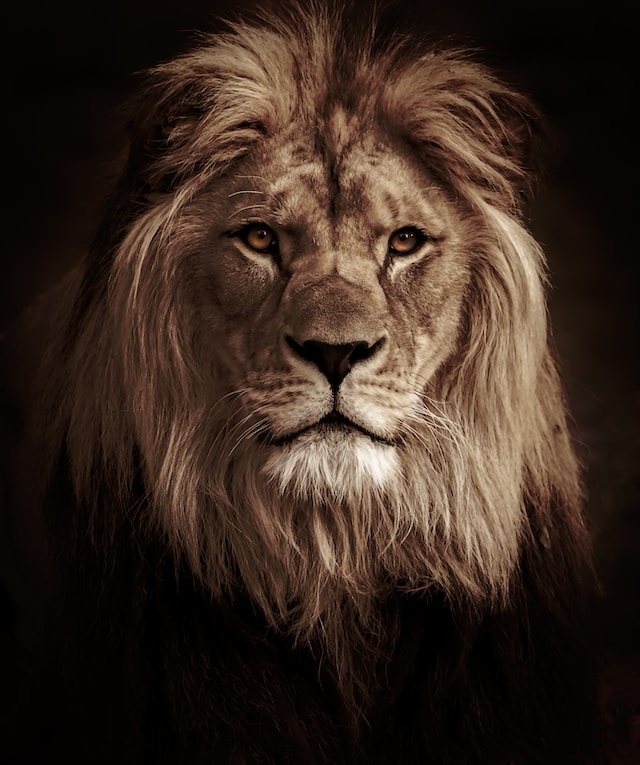

# Deep Dream

This is a PyTorch implementation of the DeepDream project.
It accepts a target image and a style image, merging them to produce a dream-inspired image. 
The resultant dream image showcases the target image infused with the specified style. 

The core scripts are placed under the directory `deepdream`. The solution employs the VGG16 network by default.

## Environment

The Anaconda environment is specified in the file `environment.yml`.

One can create the environment via the command:

```sh
conda env create -f environment.yml
```

## Command-Line Usage

I have built a command-line app named `dream.py` under the project directory.

Basic usage:

```sh
python dream.py "<target image file path>" "<style image file path>" "<output dream image file path>"
```

For more help messages, run the command:

```sh
python dream.py --help
```

## Demo

Target image:



Style image:


Command:

```sh
python dream.py ./resources/lion.jpg ./resources/gears.jpg ./resources/lion-x-gears.jpg
```

The following is the output in the terminal when running the above command:

```
2023-08-27 16:36:43,326 | INFO | Begine making the dream image
2023-08-27 16:39:21,904 | INFO | Epoch: 1 Loss: 465.61761474609375
2023-08-27 16:42:00,564 | INFO | Epoch: 2 Loss: 182.9209442138672
2023-08-27 16:44:37,262 | INFO | Epoch: 3 Loss: 120.6324462890625
2023-08-27 16:47:13,239 | INFO | Epoch: 4 Loss: 96.22435760498047
2023-08-27 16:49:50,772 | INFO | Epoch: 5 Loss: 82.47473907470703
2023-08-27 16:49:50,779 | INFO | Dream image is saved at resources/lion-x-gears.jpg
```

The resulting dream image:


